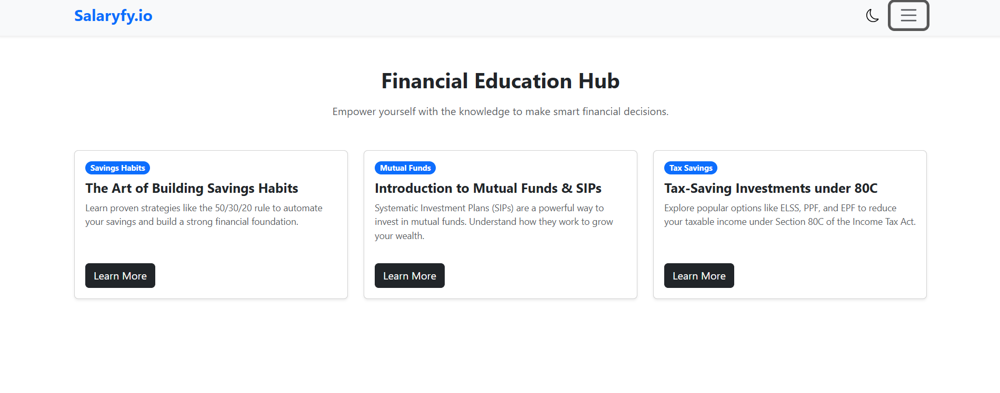

# Salaryfy.io 💰 –  Financial Awareness Platform

Salaryfy.io is a modern, responsive web application built with **React** to empower individuals with financial clarity.  
It provides **tools, calculators, and educational resources** to help users understand their **salary, taxes, and investments** with transparency and ease.

This project was developed as part of a **Frontend Developer Internship assignment** and includes **bonus features** like an AI-powered chatbot, live API integration, dark/light mode, and smooth animations.

---

## 📸 UI Screenshots

### 🖥 Desktop View
#### 🏠 Home Page (with API-driven Quote of the Day)

#### 📊 Salary Breakdown Page (with Pie Chart)

#### 💸 Tax Info Page (with Bar Chart)

#### 📚 Financial Education Hub

#### 🤖 AI Chatbot

---

### 📱 Mobile View

## ✨ Core Features

### 📊 Detailed Salary Breakdown
- Calculates a full salary breakdown from an **Annual CTC**, including **Basic, HRA, PF, and Allowances**.
- Provides **Annual and Monthly figures** in a clear, tabular format.
- Includes a **Pie Chart** for intuitive salary component visualization.

### 💸 Comprehensive Tax Information
- Features **updated Indian tax slabs for FY 2025–26 (New Regime)**.
- Displays **Bar Chart** of tax rates for better understanding.
- Includes a **simple tax estimator** to calculate tax payable based on income.

### 📚 Financial Education Hub
- Curated **articles on Savings, Mutual Funds/SIPs, and Tax-Saving Investments**.
- Direct links to trusted sources like **Investopedia** and **Zerodha Varsity**.

### 🎨 Responsive & Modern UI/UX
- Fully responsive (mobile, tablet, desktop).
- Clean, professional interface with focus on **readability and accessibility**.
- Uses an **Offcanvas Menu** for smooth mobile navigation.

---

### 🤖 Chatbot
- A static Chatbot

### 🚀 Smooth Animations & Transitions
- Built with **Framer Motion** for page transitions.  
- Subtle **hover effects and entry animations** for buttons/cards.  

### 🌐 Live API Integration
- **Quote of the Day** feature using [Quotable.io API](https://quotable.io).  

### 💡 Theme Switcher (Dark/Light Mode)
- Toggle between light and dark themes using **React state + CSS variables**.  

### 🧮 Additional Calculators
- **SIP Calculator** (Systematic Investment Plan).  
- Projects investment growth with principal, rate, and time inputs.  

### ♿ Accessibility
- **ARIA labels** on buttons, inputs, and navigation elements.  
- Keyboard navigation supported.  

---

## 🛠 Technology Stack

- **Frontend:** React.js (with Vite/CRA)
- **Styling:**  React Bootstrap / Custom CSS
- **Animations:** Framer Motion
- **API Calls:** Axios
- **Charts:** Chart.js / Recharts
- **Icons:** React Bootstrap Icons

---

